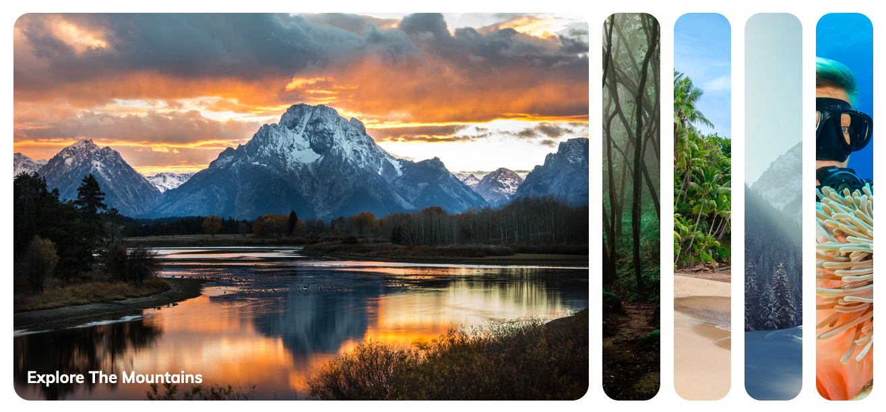

# Expanding-Cards

This is a quick little project of expanding cards that can be used as a component on a website to display a gallery of images or projects. 

This is the completed project to the first project from [50 Projects in 50 Days](https://www.udemy.com/course/50-projects-50-days/), a course I am taking on UDEMY. 

## Table of Contents

- [Overview](#overview)
    - [The Challenge](#the-challenge)
    - [Screenshot](#screenshot)
    - [Links](#links)
- [My Process](#my-process)
    - [What I Learned](#what-i-learned)
    - [Continued Development](#continued-development)
    - [Useful Resources](#useful-resources)
- [Sources](#sources)
    - Photo Sources
    - Author

## Overview

#### The Challenge

Create an expandable card layout for images, that scaled to the width of the user's device.

#### Links

- [GitHub URL](https://github.com/JohnMichaelD/expanding-cards)
- [Live URL](https://johnmichaeld.github.io/expanding-cards/)
- [UDEMY URL](https://www.udemy.com/course/50-projects-50-days/)

#### Screenshot

## My Process

#### What I Learned

This first project was fun to explore what you can do with a bit of JavaScript and CSS to create some really cool things!

One of the challenges in this project was getting the slides to showcase one image at a time, and the solution was something I had not considered before, and glad to have learned. Which was using Javascript to select the initial panel, and swap the panel's class of 'active' to the panel this is clicked. While also removing the class of 'active' to all previous panels. 

#### Continued Development

This was a great introduction into the simplicity and power of JavaScript, and look forward to diving deeping into the language. I also took this project as a time to introduce myself to Markdown, and practice what I learned in this ReadMe.

#### Useful Resources

- [Learning MarkDown](https://www.markdowntutorial.com/)

## Sources

#### Project Idea

- [Udemy](https://www.udemy.com/course/50-projects-50-days/)

#### Photo Sources

- [Photo 1 - Tetons](https://unsplash.com/photos/q-f4HuBlEMQ?utm_source=unsplash&utm_medium=referral&utm_content=creditShareLink)
- [Photo 2 - Forest](https://unsplash.com/photos/wJwx_jSgZuA?utm_source=unsplash&utm_medium=referral&utm_content=creditShareLink)
- [Photo 3 - Beach](https://unsplash.com/photos/U6t80TWJ1DM?utm_source=unsplash&utm_medium=referral&utm_content=creditShareLink)
- [Photo 4 - Winter](https://unsplash.com/photos/xAgvgQpYsf4?utm_source=unsplash&utm_medium=referral&utm_content=creditShareLink)
- [Photo 5 - Reefs](https://unsplash.com/photos/ld4VubWXTuI?utm_source=unsplash&utm_medium=referral&utm_content=creditShareLink)